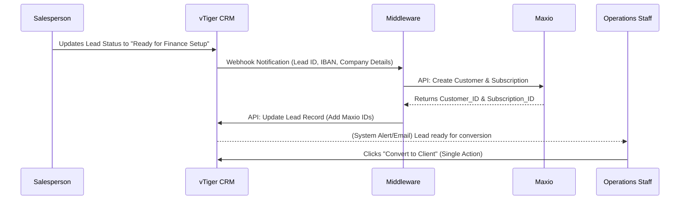
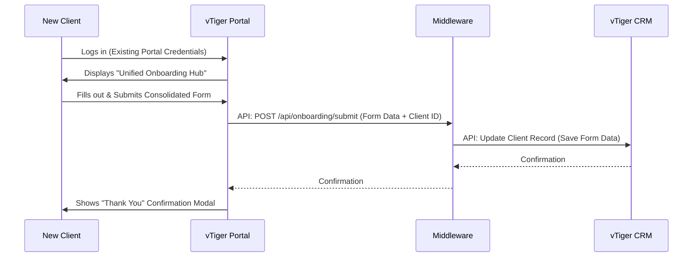
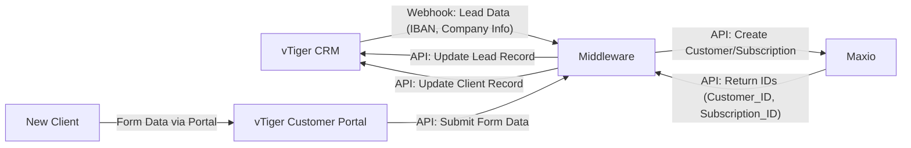

# System Flow Documentation: The HR Company Onboarding MVP

## 1. User Workflows

The MVP defines two primary user personas: **Internal Staff** (Sales, Finance, Operations) and the **New Client**. Their workflows are designed to be parallel and largely automated.

### 1.1 Internal Staff Workflow (Sales -> Finance -> Operations)

This workflow is triggered by the Salesperson and fully automated thereafter.

1. **Salesperson Action**: After the client signs the digital contract, the Salesperson manually updates the lead's status in vTiger CRM to “Ready for Finance Setup”.
2. **System Automation**: This status change triggers a webhook from vTiger CRM to the Middleware.
3. **Finance Automation**: The Middleware automatically creates the customer and subscription in Maxio using the provided data.
4. **CRM Update**: The Middleware retrieves the new IDs from Maxio and updates the lead record in vTiger CRM.
5. **Operations Action**: The Operations Staff receives a notification (via CRM alert or email) that the lead is now ready. They log into vTiger CRM and perform a single click to convert the lead into a client. The previously manual data entry is now complete.

### 1.2 New Client Workflow (Onboarding Hub)
This workflow begins after the client signs the initial contract and is granted access to the portal.

1. **Access**: The client receives their login credentials for the vTiger Customer Portal (via a separate, potentially manual, email for the MVP).
2. **Portal Login**: The client logs into the portal using their existing credentials.
3. **Form Completion**: The client navigates to (or is directed to) the “Unified Onboarding Hub” and completes the single, consolidated web form.
4. **Data Submission**: Upon clicking submit, the form data is sent via an internal API to the Middleware.
5. **CRM Update**: The Middleware saves all submitted data directly to the client’s record in vTiger CRM.
6. **Confirmation**: The client sees an on-screen confirmation message within the portal.

## 2. Data Flows
Data flows are strictly controlled and move only between the defined systems via APIs.

- **Flow 1: CRM -> Middleware -> Maxio -> Middleware -> CRM**
    - Data: Client IBAN, Company Name, Contact Email, Billing Address (from vTiger).
    - Trigger: vTiger Lead Status = "Ready for Finance Setup".
    - Destination: Maxio (to create records).
    - Return Data: Maxio Customer_ID and Subscription_ID.
    - Final Destination: Back to the originating vTiger Lead record.
- **Flow 2: Client -> Portal -> Middleware -> CRM**
    - Data: All fields from the Consolidated Form (Company Trading Name, Operating Hours, Sick Leave Policy, etc.).
    - Trigger: Client submits the form in the "Unified Onboarding Hub".
    - Destination: The corresponding Client record in vTiger CRM.
- **No Direct Flows**: There is no direct data flow between Maxio and the vTiger Customer Portal, or between Maxio and the New Client. All interactions are mediated by the Middleware.
## 3. Integration Points
The system relies on three key integration points, all using RESTful APIs.

- **Integration Point 1: vTiger CRM Webhook -> Middleware**
    - **Protocol**: HTTPS (Webhook POST request).
    - **Authentication**: HMAC Signature Validation using a pre-shared secret.
    - **Payload**: JSON containing the updated lead record data, including the new status and critical fields like IBAN.
    - **Purpose**: To notify the Middleware that a new client setup should be initiated.
- **Integration Point 2: Middleware <-> Maxio API**
    - **Protocol**: HTTPS (REST API calls).
    - **Authentication**: API Key (sent in Authorization header).
    - **Endpoints**:
        - POST /customers (Create new customer)
        - POST /subscriptions (Create new subscription for customer)
    - **Purpose**: To automate the creation of financial records in Maxio.
- **Integration Point 3: Middleware <-> vTiger CRM API**
    - **Protocol**: HTTPS (REST API calls).
    - **Authentication**: Access Key + Username (sent in headers or as query parameters, per vTiger API spec).
    - **Endpoints**:
        - PUT /Leads/{record_id} (Update lead record with Maxio IDs)
        - PUT /Contacts/{record_id} or PUT /Leads/{record_id} (Update client record with form data)
    - **Purpose**: To update CRM records with data from Maxio and from the client portal.
- **Integration Point 4: vTiger Customer Portal -> Middleware (Internal API)**
    - **Protocol**: HTTPS (Internal REST API).
    - **Authentication**: Bearer Token (using a pre-shared secret).
    - **Endpoint**: POST /api/onboarding/submit
    - **Purpose**: To securely transmit the client's form data from the frontend portal to the backend Middleware for persistence in the CRM.
## 4. Error Handling
A robust error handling strategy is crucial for a reliable prototype, especially for asynchronous operations.

- Webhook Handling:
    - Invalid Signature: Immediately return 401 Unauthorized. Log the event for security monitoring.
    - Non-Relevant Event: Return 200 OK with { "status": "ignored" }. Log the event for debugging.
    - Processing Error: Return 200 OK to acknowledge receipt (to prevent vTiger from retrying), but log the error internally and trigger an alert (e.g., Slack message, email to dev team).
- Asynchronous Job Processing (CRM <-> Maxio Sync):
    - Maxio API Failure (Create Customer/Subscription): Catch the error, update the sync_jobs database record with status: 'failed' and the error message. Log the full error. The BullMQ queue will automatically retry the job (e.g., 3 times with exponential backoff) based on its configuration.
    - vTiger API Failure (Update Record): Catch the error, update the sync_jobs record with status: 'failed' and the error message. Log the error. Do not retry indefinitely; after the final retry, alert the operations team for manual intervention.
    - Job Success: Update sync_jobs record with final status: 'crm_updated'.
- Client Form Submission:
    - Middleware API Failure: If the Middleware cannot reach the vTiger CRM API, return a 500 Internal Server Error to the portal. The portal should display a user-friendly error message (e.g., "Submission failed. Please try again later.") and preserve the form data in the browser (via sessionStorage).
    - Validation Errors: If the CRM API returns a validation error (e.g., a required field is missing), the Middleware should return a 400 Bad Request with a clear error message. The portal should display this message next to the relevant field.
- General Strategy:
    - Logging: All errors, warnings, and critical info events must be logged with context (e.g., job ID, lead ID, timestamp).
    - Monitoring: Use the PaaS platform's built-in monitoring for system health (CPU, memory). Set up alerts for critical failures (e.g., job queue depth growing, repeated API failures).
    - Idempotency: Design API calls to be idempotent where possible (e.g., updating a CRM record with the same Maxio ID multiple times should not cause harm) to handle potential duplicate webhook deliveries or retries safely.