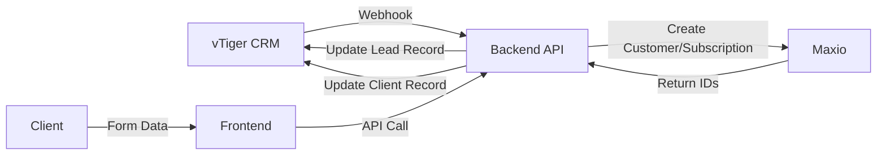

# HR Onboarding MVP

A comprehensive HR onboarding application built with Next.js, Node.js, and Docker. This MVP automates the bi-directional data flow between vTiger CRM and Maxio finance system, and provides a unified onboarding hub for new clients.

## Features

### Core Functionality
- **Automated CRM-Finance Sync**: Automatically provisions client payment details from vTiger CRM to Maxio upon contract signing
- **Unified Onboarding Hub**: Single, dynamic web form for collecting all necessary client information
- **Real-time Progress Tracking**: Visual indicators showing completion status
- **Form Data Persistence**: Automatic saving to prevent data loss
- **File Upload Support**: Optional document upload functionality

### Technical Features
- **Modern Tech Stack**: Next.js 14, TypeScript, Tailwind CSS, Node.js, Express
- **Containerized Deployment**: Full Docker setup with docker-compose
- **Database Integration**: PostgreSQL for logging and job tracking
- **Job Queue System**: BullMQ with Redis for asynchronous processing
- **Comprehensive Logging**: Winston-based logging with multiple levels
- **Error Handling**: Robust error boundaries and validation
- **Security**: API token authentication, rate limiting, CORS protection

## Quick Start

### Prerequisites
- Docker and Docker Compose
- Node.js 18+ (for local development)

### One-Command Deployment

```bash
# Clone the repository
git clone <repository-url>
cd hr-onboarding

# Copy environment configuration
cp env.example .env

# Start all services with Docker Compose
docker-compose up -d
```

This will start:
- **Frontend**: http://localhost:3000
- **Backend API**: http://localhost:3001
- **PostgreSQL**: localhost:5432
- **Redis**: localhost:6379

### Environment Configuration

Edit the `.env` file with your actual credentials:

```env
# Application
APP_SECRET_TOKEN=your_strong_secret_token_here

# vTiger CRM
VTIGER_API_URL=https://yourcompany.vtiger.com/restapi/v1
VTIGER_ACCESS_KEY=your_vtiger_access_key
VTIGER_USERNAME=your_vtiger_username
VTIGER_WEBHOOK_SECRET=your_webhook_validation_secret

# Maxio
MAXIO_API_URL=https://api.maxio.com/v1
MAXIO_API_KEY=your_maxio_api_key
MAXIO_DEFAULT_PRODUCT_HANDLE=default-hr-package
```

## Architecture

### System Flow



### Component Structure

```
src/
├── app/                    # Next.js app directory
│   ├── globals.css        # Global styles
│   ├── layout.tsx         # Root layout
│   └── page.tsx           # Home page
├── components/            # React components
│   ├── sections/          # Form sections
│   ├── FormField.tsx      # Reusable form field
│   ├── ProgressTracker.tsx # Progress indicator
│   └── ...
├── context/               # React Context
│   └── OnboardingContext.tsx
└── types/                 # TypeScript types
    └── index.ts

backend/
├── src/
│   ├── config/            # Configuration
│   ├── controllers/       # Route controllers
│   ├── middleware/        # Express middleware
│   ├── routes/            # API routes
│   ├── services/          # External API services
│   ├── workers/           # Background job workers
│   └── utils/             # Utility functions
```

## API Endpoints

### Frontend API
- `POST /api/onboarding/submit` - Submit onboarding form
- `GET /api/onboarding/client/:id` - Get client data

### Webhook Endpoints
- `POST /webhook/vtiger/lead-status-change` - vTiger webhook handler
- `GET /webhook/vtiger/status/:jobId` - Check sync job status

### Health Check
- `GET /health` - Basic health check
- `GET /health/detailed` - Detailed health check with dependencies

## Development

### Local Development Setup

```bash
# Install dependencies
npm install
cd backend && npm install

# Start development servers
npm run dev          # Frontend (port 3000)
npm run backend:dev  # Backend (port 3001)

# Or use Docker for development
docker-compose -f docker-compose.dev.yml up
```

### Available Scripts

```bash
# Frontend
npm run dev          # Start development server
npm run build        # Build for production
npm run start        # Start production server
npm run lint         # Run ESLint

# Backend
npm run backend:dev  # Start backend development server
npm run backend:build # Build backend
npm run backend:start # Start backend production server

# Docker
npm run docker:up    # Start all services
npm run docker:down  # Stop all services
npm run docker:build # Build all images
npm run docker:logs  # View logs
```

## Testing

### Manual Testing Workflow

1. **Start the application**: `docker-compose up -d`
2. **Access the frontend**: http://localhost:3000
3. **Complete the onboarding form** with test data
4. **Check backend logs**: `docker-compose logs backend`
5. **Verify database**: Connect to PostgreSQL and check tables

### API Testing

```bash
# Test health endpoint
curl http://localhost:3001/health

# Test API authentication
curl -H "Authorization: Bearer demo-secret-token" \
     http://localhost:3001/api/test

# Submit test form data
curl -X POST \
     -H "Authorization: Bearer demo-secret-token" \
     -H "Content-Type: application/json" \
     -d '{"clientId":"test-123","companyTradingName":"Test Corp"}' \
     http://localhost:3001/api/onboarding/submit
```

## Monitoring and Logs

### View Logs
```bash
# All services
docker-compose logs -f

# Specific service
docker-compose logs -f backend
docker-compose logs -f frontend
```

### Health Monitoring
- **Frontend**: http://localhost:3000
- **Backend Health**: http://localhost:3001/health
- **Database**: Connect to localhost:5432
- **Redis**: Connect to localhost:6379

## Deployment

### Production Deployment

1. **Configure environment variables** in `.env`
2. **Build and deploy**:
   ```bash
   docker-compose -f docker-compose.prod.yml up -d
   ```
3. **Set up reverse proxy** (nginx/traefik) for SSL termination
4. **Configure monitoring** and log aggregation

### Environment-Specific Configurations

- **Development**: `docker-compose.yml`
- **Staging**: `docker-compose.staging.yml`
- **Production**: `docker-compose.prod.yml`

## Security Considerations

- API tokens are required for all backend endpoints
- Webhook signatures are validated
- Rate limiting is implemented
- CORS is properly configured
- File uploads are restricted by type and size
- Database credentials are environment-based

## Troubleshooting

### Common Issues

1. **Port conflicts**: Ensure ports 3000, 3001, 5432, 6379 are available
2. **Database connection**: Check PostgreSQL container health
3. **Redis connection**: Verify Redis container is running
4. **API authentication**: Ensure APP_SECRET_TOKEN is set correctly

### Debug Commands

```bash
# Check container status
docker-compose ps

# View container logs
docker-compose logs [service-name]

# Execute commands in container
docker-compose exec backend sh
docker-compose exec postgres psql -U user -d mvp_logs

# Restart specific service
docker-compose restart backend
```

## Contributing

1. Fork the repository
2. Create a feature branch
3. Make your changes
4. Add tests if applicable
5. Submit a pull request

## License

This project is licensed under the MIT License - see the LICENSE file for details.

## Support

For support and questions:
- Email: support@thehrcompany.com
- Documentation: [Link to detailed docs]
- Issues: [GitHub Issues]